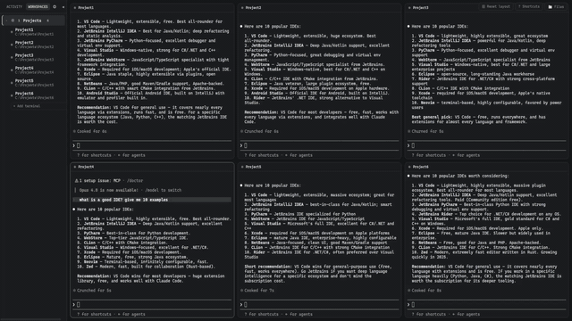
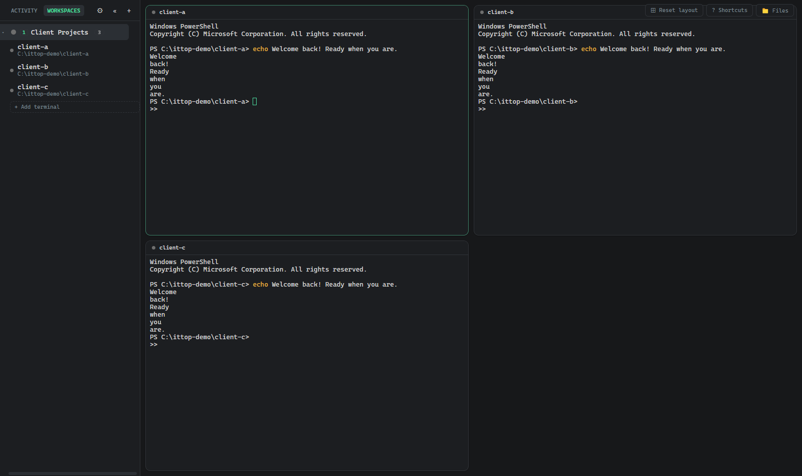
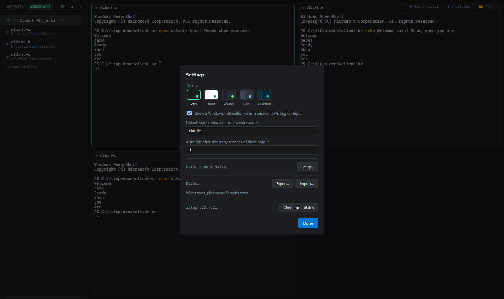
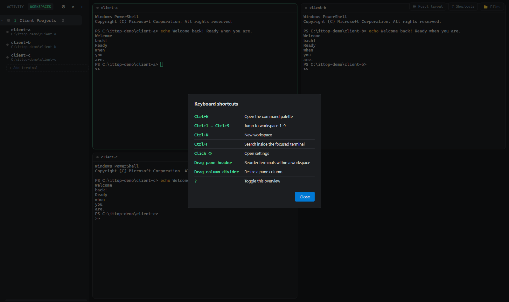

# ittop: Multi-Workspace Manager for Claude Code, Codex & Co.

[](LICENSE)
[](#prerequisites)
[](https://github.com/pottz91/ittop/releases/latest)
[](https://github.com/pottz91/ittop/releases/latest)
[](https://github.com/pottz91/ittop/releases/latest)

### 📥 [Download the latest installer](https://github.com/pottz91/ittop/releases/latest)

<p align="center"></p>

**ittop organizes multiple parallel [Claude Code](https://claude.com/claude-code) sessions into
Workspaces on Windows and macOS, built for vibe coding.** It's not a replacement for Claude Code,
it's the missing layer around it. Each Terminal's start command is just a plain string, so it
works just as well for Codex CLI, Gemini CLI, or any other terminal-based coding agent. Quick facts:

- 🪟🍎 **Native desktop app** on Windows (ConPTY) and macOS (unsigned build, see
  [Getting started](#getting-started)). No WSL, no separate terminal emulator, no cloud account.
- 🧩 **Workspaces group Terminals**: each Workspace holds any number of Terminals (own folder +
  start command, so any CLI agent works, not just `claude`), opened tiled together with one click.
- 🟢 **Live status per session** + a desktop notification the moment one is waiting on you.
- 📁 **Built-in file explorer** with Markdown/HTML preview, no alt-tabbing to VS Code.
- 🎙️ **Works with voice dictation tools** (Wispr Flow, Windows Voice Access, Spokenly, etc.):
  copy/paste and dictated text land correctly inside Claude Code's own UI.
- 🎨 5 themes, full backup/restore, auto-updates via GitHub Releases.
- 🆓 **100% free, open-source, MIT-licensed.** No telemetry, no account, no cloud sync.

## Screenshots

| Multiple terminals, one Workspace | Settings | Keyboard shortcuts |
| --- | --- | --- |
|  |  |  |

## Why ittop over a tmux-based session manager or a hosted GUI

Most Claude Code / AI coding agent session managers fall into one of two camps: a `tmux`-wrapping
TUI (great if you already live in a Unix terminal, awkward to set up on native Windows), or a
hosted/commercial GUI with cloud sync and subscription tiers. ittop is neither:

- **Actually native to Windows**: real ConPTY processes, no WSL layer, no Unix terminal emulator
  pretending to be a Windows app.
- **Workspaces of Terminals, not just tabs**: group related sessions (frontend + backend + docs
  agent, or five clients' repos) under one named Workspace that opens them all tiled together.
- **A file explorer built in**: browse and preview (Markdown rendered, HTML rendered sandboxed)
  whatever project a focused terminal is pointed at, without alt-tabbing to VS Code.
- **100% local and free**: MIT-licensed, no telemetry, no account, no cloud sync. Your
  `workspaces.json` never leaves your machine.

## Features

- **Workspaces containing Terminals**: a Workspace is a named group (e.g. one per project or
  client); each Workspace holds any number of Terminals (own project folder + start command).
  Opening a Workspace tiles all its Terminals together; other Workspaces keep running in the
  background, mounted but hidden, so switching back never loses scrollback or restarts a session.
- **Real terminals**: each Terminal gets its own `node-pty` process (ConPTY on Windows),
  rendered with `xterm.js`. 10,000 lines of scrollback, `Ctrl+F` in-terminal search,
  drag-to-reorder panes, resizable columns.
- **Copy/paste and voice dictation that actually work inside Claude Code's own UI**: fixed a
  common xterm.js pitfall where `Ctrl+V` gets swallowed before the browser's paste event ever
  fires, which also silently broke text-injection-based tools like Wispr Flow, Windows Voice
  Access, and Spokenly.
- **Status detection**, via two independent signals:
  1. OSC 9 / OSC 777 "attention" escape sequences parsed straight out of the PTY stream.
  2. A tiny localhost HTTP server that Claude Code's `Notification` / `Stop` hooks POST to
     (see [Setting up Claude Code hooks](#setting-up-claude-code-hooks) below).

  Sidebar ring: 🔵 blue = waiting for input · 🟢 pulsing green = working · ⚪ grey = idle/done.
  A Windows notification fires on "waiting for input" whenever the app isn't focused, and
  unread events show as a badge count until you open the workspace.
- **Built-in file explorer**: a collapsible, lazily-loaded file tree scoped to whichever
  Terminal has focus, with a read-only preview. Markdown renders formatted, HTML renders
  sandboxed (no scripts) like a real page, everything else as plain text. Pop any preview out
  into its own resizable window.
- **Keyboard shortcuts**: `Ctrl+1`…`Ctrl+9` jump to a Workspace, `Ctrl+N` new Workspace,
  `Ctrl+K` command palette, arrow keys to cycle Workspaces.
- **Lives in the system tray**: closing the window keeps every session running in the
  background instead of quitting. Tray menu: Open, Check for updates, Quit.
- **5 themes** (Dark, Light, Dracula, Nord, Solarized), full settings + Workspace backup/restore
  (export/import as JSON), auto-updates via GitHub Releases.
- On restart, you're asked whether to relaunch the previously active session (Claude Code
  sessions don't survive an app restart).

## Prerequisites

- Windows 10/11 or macOS (Intel or Apple Silicon)
- [Claude Code CLI](https://claude.com/claude-code) installed and on your `PATH` (the default
  start command for a new workspace is `claude`)
- Git (optional, only needed for the branch indicator in the sidebar)
- [Node.js](https://nodejs.org/) 18 or newer, only if you're building from source instead of
  using the installer

`node-pty` ships prebuilt native binaries (N-API, ABI-stable) for `win32-x64`/`win32-arm64` and
`darwin-x64`/`darwin-arm64`, so a normal `npm install` works out of the box on both platforms.
**No Visual Studio Build Tools / Xcode Command Line Tools required** for everyday use. You'd
only need them if you ever have to compile `node-pty` from source (see
[Troubleshooting](#troubleshooting)).

## Getting started

**Just want to use it?** Download the installer from [Releases](https://github.com/pottz91/ittop/releases/latest),
run it, done. `npm install` is only needed if you're building from source.

🛡️ Every Windows installer is scanned with [VirusTotal](https://www.virustotal.com/) right
after it's built. The report link is posted in that release's notes.

### macOS

macOS builds (Intel `ittop-<version>.dmg` and Apple Silicon `ittop-<version>-arm64.dmg`) are
published alongside the Windows installer, but they're **ad-hoc signed only, not notarized**
(no Apple Developer account behind this project). Gatekeeper will refuse a normal double-click
open the first time with "unidentified developer". To open it anyway:

1. Mount the DMG and drag `ittop.app` into `/Applications`.
2. Right-click `ittop.app` → **Open** → confirm in the dialog that appears (only needed once).

If you instead see "**ittop** is damaged and can't be opened", that means Gatekeeper's quarantine
check failed outright (can happen depending on how the file was downloaded); run
`xattr -cr /Applications/ittop.app` in Terminal, then try opening it again.

### Build from source (optional)

```bash
npm install
npm run dev      # starts the app in development mode with hot reload
```

To run a production-style build without packaging an installer:

```bash
npm run build
npm start
```

To build a distributable installer:

```bash
npm run build:win    # Windows: NSIS .exe
npm run build:mac    # macOS: .dmg + .zip (unsigned, run on a Mac)
```

The output lands in `dist/` (e.g. `dist/ittop-1.0.0-setup.exe`). Building the
installer does **not** require Visual Studio Build Tools / Xcode Command Line Tools either:
`electron-builder.yml` sets `npmRebuild: false` since `node-pty`'s N-API prebuilds are already
ABI-compatible with Electron.

## Setting up Claude Code hooks

The hook path is the more reliable of the two status signals (OSC codes depend on what the
CLI/tools inside your session choose to emit). To wire it up:

1. Start the app once. It opens a local HTTP listener on `127.0.0.1:47823`.
2. Open your Claude Code settings (global `~/.claude/settings.json`, or a project's
   `.claude/settings.json`) and merge in the following hooks. They forward Claude Code's own
   hook JSON straight to the app on stdin, unmodified, via `curl.exe` (ships with Windows 10+):

```json
{
  "hooks": {
    "Notification": [
      {
        "matcher": "",
        "hooks": [
          {
            "type": "command",
            "command": "curl.exe -s -X POST -H \"Content-Type: application/json\" --data-binary @- --max-time 2 http://127.0.0.1:47823"
          }
        ]
      }
    ],
    "Stop": [
      {
        "matcher": "",
        "hooks": [
          {
            "type": "command",
            "command": "curl.exe -s -X POST -H \"Content-Type: application/json\" --data-binary @- --max-time 2 http://127.0.0.1:47823"
          }
        ]
      }
    ]
  }
}
```

> Older instructions used an inline PowerShell one-liner with `$json`/`$body` variables to
> remap the payload before sending it. Don't do that: Claude Code runs hook commands through
> Git Bash on Windows, which expands `$json`/`$body` to nothing before PowerShell ever sees
> them, silently breaking the hook. The `curl` command above avoids the problem entirely by
> not needing any shell variables. ittop reads Claude Code's raw hook field names
> (`hook_event_name`, `cwd`, `message`) directly.

3. That's it. Restart your Claude Code session inside a workspace and the sidebar status ring
   will react to real `Notification`/`Stop` events instead of relying only on OSC parsing.

The app matches an incoming hook event to a workspace by comparing `projectPath` (the hook's
`cwd`) against each workspace's configured project folder, so make sure the workspace's folder
matches the directory you actually run `claude` from.

## Keyboard shortcuts

| Shortcut          | Action                                    |
| ------------------ | ----------------------------------------- |
| `Ctrl+1`–`Ctrl+9`  | Jump to workspace 1–9                     |
| `Ctrl+N`           | New workspace dialog                      |
| `Ctrl+K`           | Command palette                           |
| `↑` / `↓`          | Cycle workspaces (outside a terminal)     |
| `Ctrl+F`           | Search inside the focused terminal        |
| `?`                | Show all shortcuts                        |

## Architecture

```
src/
  main/       Electron main process: PTY manager, status manager, OSC parser,
              localhost hook server, git branch poller, JSON persistence, IPC handlers.
  preload/    contextBridge API exposed to the renderer as window.api.
  renderer/   React UI: Sidebar, TerminalPane (xterm.js), FileExplorer/PreviewWindow,
              workspace/terminal dialogs, zustand store.
  shared/     Types and IPC channel names shared between main/preload/renderer.
```

PTY processes only ever live in the main process; the renderer talks to them exclusively
through the IPC channels defined in `src/shared/types.ts`. On app quit, all PTY process trees
are killed via `tree-kill` so no orphaned `claude` processes are left running.

## Releasing

Pushing a tag matching `v*` (e.g. `v1.1.0`) runs [`.github/workflows/release.yml`](.github/workflows/release.yml),
which builds the Windows installer and publishes it as a GitHub Release. `electron-updater`
(wired up in Settings → Check for updates) reads that release feed, so once one is published
every installed copy of ittop can update to it automatically.

## Troubleshooting

- **Nothing happens when I create a workspace**: make sure the start command (`claude` by
  default) is resolvable from a plain PowerShell in that folder; try running it manually first.
- **Git branch doesn't show up**: the sidebar polls `git rev-parse --abbrev-ref HEAD` every
  5 seconds; this silently returns nothing for folders that aren't git repositories.
- **`node-pty` fails to load a native module**: this should not happen with the bundled
  prebuilt binaries. If you're on an unsupported architecture and need to compile from source,
  install the "Desktop development with C++" workload via Visual Studio Build Tools, then run
  `npx electron-rebuild -f -w node-pty`.
- **No desktop notifications**: Windows notifications are suppressed while the app window is
  focused, and require Windows notifications to be enabled for the app in Windows Settings.

## License

[MIT](LICENSE): free for personal and commercial use, no warranty. ittop is an independent,
unofficial tool and isn't affiliated with or endorsed by Anthropic.
